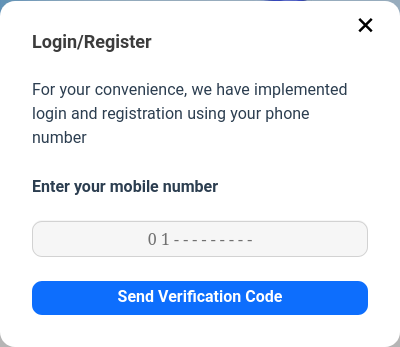
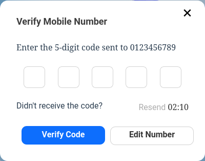
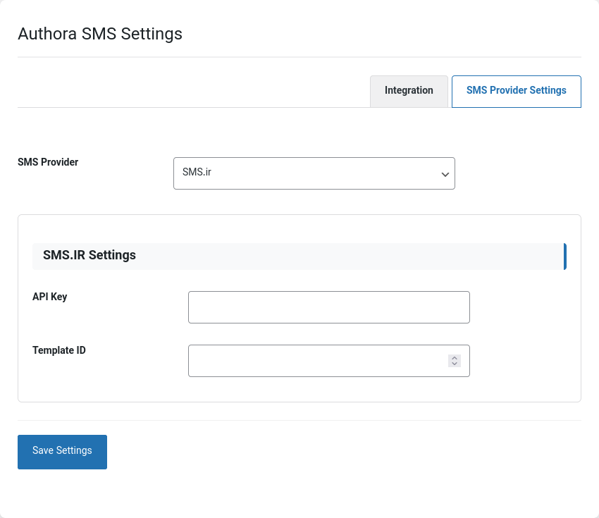

<div align="center">
    <picture>
        
    </picture>
    <p>Easy login with mobile number for WordPress</p>
</div>

# Authora

Authora is a lightweight and developer-friendly WordPress plugin that enables users to log in using just their mobile number — no passwords, no emails, no hassle.

It provides a modern, secure, and user-friendly passwordless login experience for WordPress websites, using OTP (One-Time Password) verification via SMS.

# Features:

- Passwordless Login

- Login with mobile number only

- Automatic sending of verification code (OTP) via SMS

- Automatic registration on first login (if no account)

- Compatible with popular WordPress themes and plugins

# Why Authora?

In today’s world, users are tired of lengthy registration and login forms. Authora provides a fast and enjoyable experience, especially for WooCommerce stores, membership sites, and websites that want to make the login process simpler and more secure.

# Installation

- Upload the plugin to your WordPress `/wp-content/plugins/` directory.

- Activate the plugin via the WordPress admin panel.

- Configure your SMS gateway settings under Settings → Authora.

- Use the `[authora-login]` shortcode wherever you want the login form to appear.

```php
<?php echo do_shortcode("[authora-login]"); ?>
```

# Screenshots

<table class="table">
  <thead>
    <tr>
      <th scope="col" width="1000px">OTP Authora</th>
      <th scope="col" width="1000px">Verify OTP Authora</th>
      <th scope="col" width="1000px">Admin Authora</th>
    </tr>
  </thead>
  <tbody>
    <tr>
      <td>
        
      </td>
      <td>
        
      </td>
      <td>
        
      </td>
    </tr>
  </tbody>
</table>